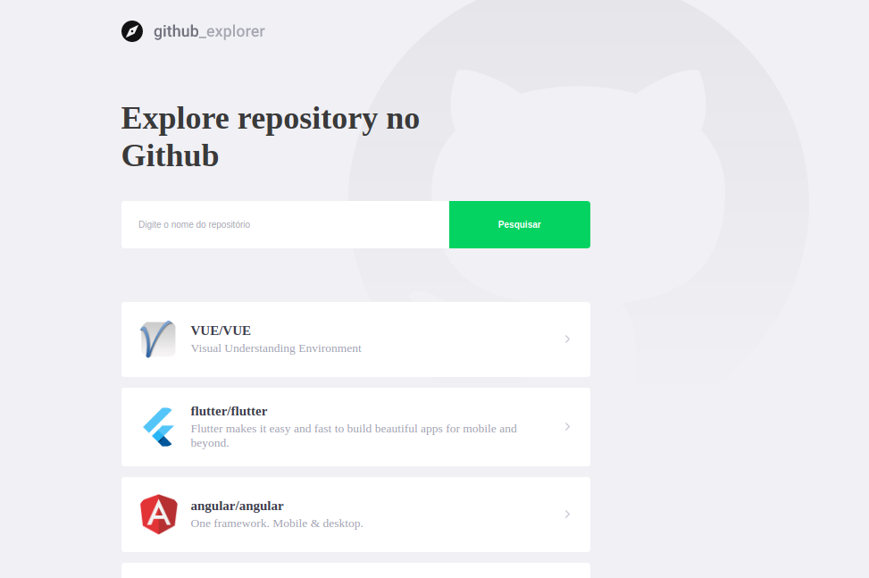
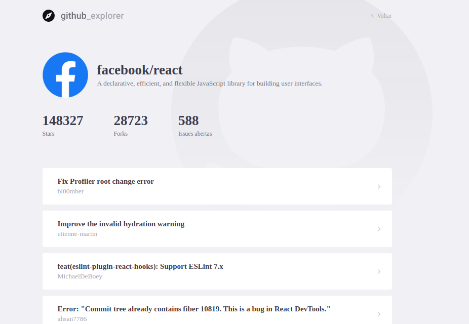

### `yarn start`

### `yarn build`

## `Descrição do projeto`

Sistema desenvolvido em reactJs para busca de repositórios no github usando a propria api do github, sendo mostrado o avatar do proprietário do repositório, detatalhes, quantidades de forks, stars, e issues aberta, bem como a lista com todas as issues abesta, com a possibilidade de lavar para pagina da issue no github para mais detalhes da mesma.

